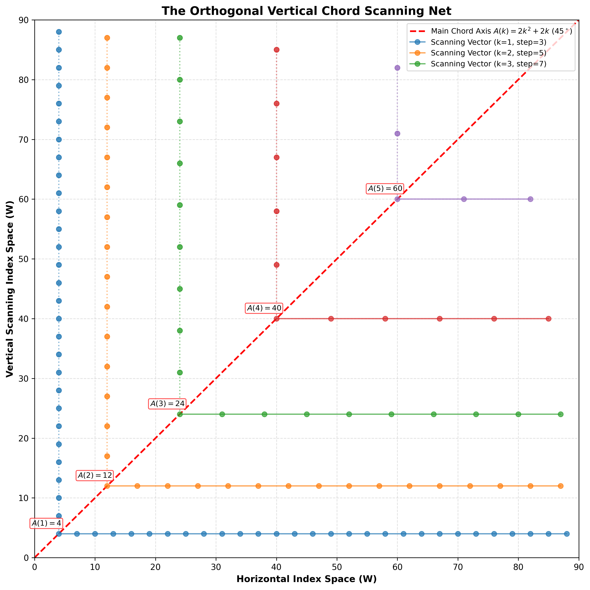

# ⚡ Two-Dimensional Lattice Distribution of Primes via Vertical Scanning

[](https://zenodo.org/)
[](https://opensource.org/licenses/MIT)
[](https://www.python.org/)
[](https://numba.pydata.org/)

An ultra-fast, geometrically-inspired, parallelized prime-counting algorithm based on **Vertical Chord Scanning** along the Main Chord Axis $A(k) = 2k^2 + 2k$.

---

## 📌 Overview

Traditional prime sieves (such as the Sieve of Eratosthenes or Atkin) operate primarily via 1D array traversals. The **Vertical Chord Sieve** structures the composite odd index space $W$ into an orthogonal 2D lattice.

By launching vertical scanning vectors from nodes on the Main Chord Axis ($A(k)$) with a linear step size of $(2k + 1)$, this formulation optimizes memory locality and cache usage, enabling high-performance parallel computation of the prime-counting function $\pi(N)$.

---

## 📐 Mathematical Formulation

For each order $k \in \mathbb{N}_{\ge 1}$, the anchor point on the main axis ($45^\circ$) is defined quadraticly as:
$$A(k) = 2k^2 + 2k$$

From each node $A(k)$, an orthogonal vertical vector scans the index space $W$. Any composite node along this vector is located at:
$$W(k, i) = A(k) + i \cdot (2k + 1), \quad i \in \mathbb{N}_{\ge 0}$$

### Upper Bound for $k$
To cover all composites up to a limit $W$, the upper bound $k_{\text{max}}$ is evaluated directly in $O(1)$ time:
$$k_{\text{max}} = \frac{\sqrt{2W + 1} - 1}{2}$$

---

## 🎨 Geometric Representation

The structural symmetry and vertical scanning vectors are illustrated below:



*Figure 1: The Orthogonal Scanning Net showing anchor points $A(k)$ on the main diagonal ($45^\circ$) and vertical rays for each order $k$.*

---

## 🚀 Benchmarks & Performance

All benchmarks were evaluated on a multi-core CPU using **Numba JIT compilation** with parallel segment execution (`prange`).

| Range ($N$) | Bound Level ($max\_w$) | Max Chord Order ($k_{\text{max}}$) | Calculated $\pi(N)$ | Execution Time (seconds) |
| :---: | :---: | :---: | :---: | :---: |
| **$10^7$** | $4,999,999$ | $1,580$ | $664,579$ | $1.96$ |
| **$10^8$** | $49,999,999$ | $4,999$ | $5,761,455$ | $2.36$ |
| **$10^9$** | $499,999,999$ | $15,811$ | **$50,847,534$** | **$8.06$** |
| **$10^{10}$** | $4,999,999,999$ | $49,999$ | **$455,052,511$** | **$66.93$** |

---

## 🛠️ Installation & Usage

### Prerequisites
* Python 3.8+
* NumPy
* Numba

bash
```
pip install numpy numba
```
## Quick Start
Python:
```
from chord_sieve import count_primes

#Evaluate pi(10^9)
N = 1_000_000_000
prime_count, elapsed_time = count_primes(N)

print(f"pi({N:,}) = {prime_count:,}")
print(f"Time taken: {elapsed_time:.2f} seconds")
```
## 📜 Citation & Research Paper
If you use this work in your research, please cite the corresponding Zenodo publication:

مقتطف الرمز
@article{vertical_chord_sieve_2026,
  author    = {Author Name},
  title     = {Two-Dimensional Lattice Distribution of Primes via Vertical Scanning along the Main Chord Axis A(k)},
  journal   = {Zenodo},
  year      = {2026},
  doi       = {10.5281/zenodo.xxxxxxx}
}